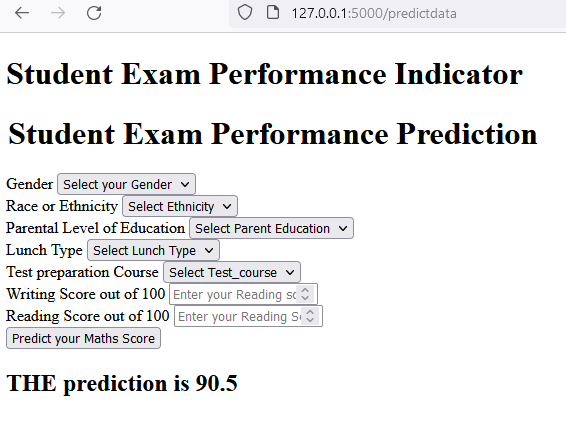

# Machine Learning Project Pipeline

This is a machine learning project pipeline that uses multiple algorithms to make predictions and has a front-end interface for users to interact with. The project is designed to predict a target variable based on a set of input features.

## Setup

To set up the project, follow these steps:

    Clone the repository to your local machine.
    Install the required dependencies by running pip install -r requirements.txt in your terminal.
    Set up a virtual environment for the project (optional but recommended).

## Usage

To use the project, follow these steps:

    Run the app.py file to start the front-end interface.
    Enter the input features in the interface and click on the "Predict" button.
    The predicted value will be displayed on the interface.

## Algorithms

The project uses multiple algorithms to make predictions. The algorithms currently implemented are:

    Linear Regression
    Random Forest Regression
    Support Vector Regression

The algorithms are implemented using the scikit-learn library in Python.

## Dataset

The project uses a dataset of [insert name of dataset] to train the algorithms. The dataset is preprocessed and cleaned before being used in the pipeline.

## Front-end

The front-end of the project is built using [insert name of front-end library or framework]. It allows users to input the values of the input features and displays the predicted value.

## Conclusion

This machine learning project pipeline is designed to predict a target variable using multiple algorithms and a front-end interface. It can be extended and customized to suit different use cases and datasets.

